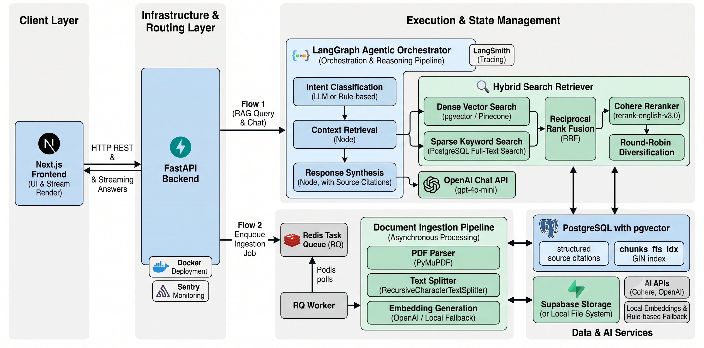
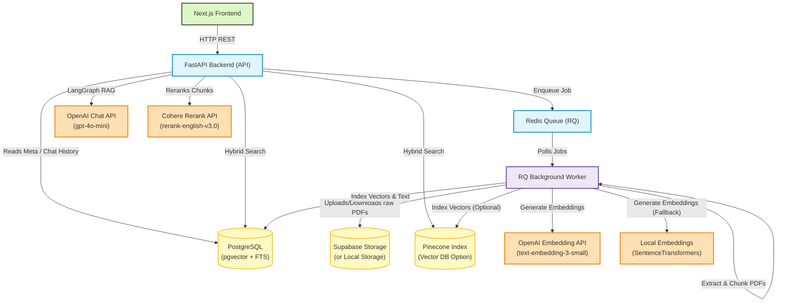
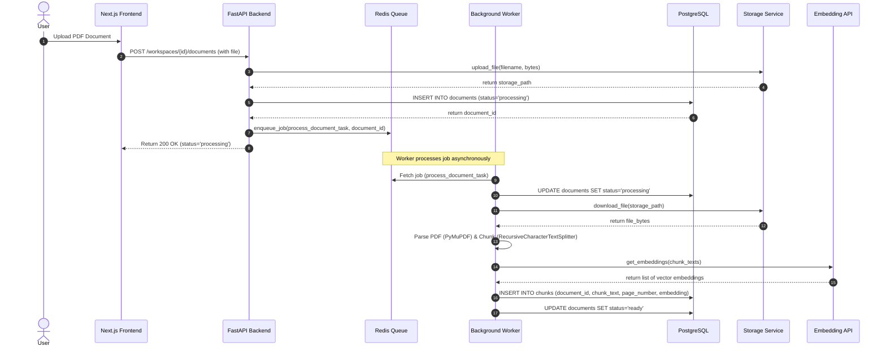
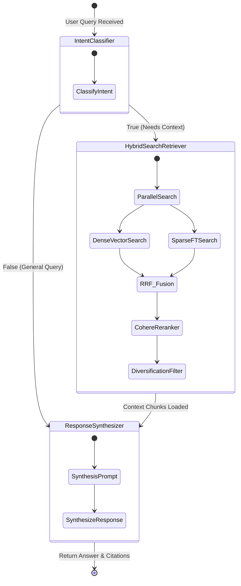

# AI Research Intelligence Platform

A modular, production-grade hybrid search RAG (Retrieval-Augmented Generation) pipeline for managing scientific research papers and documents. The platform provides localized document ingestion, vector similarity search combined with full-text search, reranking, and agentic response synthesis.

---

## Key Features

- **Hybrid Search RAG**: Integrates dense vector embeddings (OpenAI `text-embedding-3-small` or local `sentence-transformers`) with sparse PostgreSQL full-text search, combined via **Reciprocal Rank Fusion (RRF)**.
- **Reranking**: Utilizes the Cohere Rerank API to select top candidate chunks.
- **Agentic Orchestration**: Uses **LangGraph** state graphs to determine query intent, retrieve context, format strict source citations, and synthesize responses.
- **Background Ingestion Workers**: Offloads heavy PDF parsing (PyMuPDF) and embedding calculations to an asynchronous RQ task queue backed by Redis.
- **Full Offline Capability**: Automatically falls back to free, local alternatives (Postgres pgvector, keyword heuristics, local rule-based answers) when external API keys are missing.
- **Production Observability**: Configured with Sentry error monitoring and LangSmith execution tracing.

---

## Architecture



### Component Architecture (Mermaid)


### Document Ingestion Sequence


### LangGraph RAG State Flow


---

## Project Structure

The codebase is divided into two primary workspaces:

* **[backend](file:///home/sam/projects/ai/ai-research-intelligence-platform/backend)**: FastAPI API service and background workers.
  - **[src/main.py](file:///home/sam/projects/ai/ai-research-intelligence-platform/backend/src/main.py)**: API routes (workspaces, documents, chat/streaming endpoints).
  - **[src/services/orchestrator.py](file:///home/sam/projects/ai/ai-research-intelligence-platform/backend/src/services/orchestrator.py)**: LangGraph state machine orchestrating RAG pipeline stages.
  - **[src/services/retrieval.py](file:///home/sam/projects/ai/ai-research-intelligence-platform/backend/src/services/retrieval.py)**: Dense pgvector search, FTS, RRF, and Cohere reranker.
  - **[src/tasks/ingestion.py](file:///home/sam/projects/ai/ai-research-intelligence-platform/backend/src/tasks/ingestion.py)**: Asynchronous task pipeline for downloading, parsing, chunking, and indexing document uploads.
  - **[tests/](file:///home/sam/projects/ai/ai-research-intelligence-platform/backend/tests)**: Unit tests and edge boundary test suites.
* **[frontend](file:///home/sam/projects/ai/ai-research-intelligence-platform/frontend)**: Next.js user interface utilizing TailwindCSS and Sentry logging.

---

## Prerequisites

- Python 3.12+
- Node.js 18+
- PostgreSQL (with `pgvector` extension)
- Redis

---

## Setup & Execution

### 1. Configure Environment Variables
Copy the backend configuration template and populate your API credentials:
```bash
cp backend/.env.example backend/.env
```

To configure external paid services (OpenAI, Pinecone, Cohere, Supabase, Sentry, LangSmith), uncomment and populate their respective slots in the `.env` file. If left commented, the platform runs using local fallback services.

### 2. Containerized Deployment (Recommended)
You can start the entire stack (PostgreSQL with pgvector, Redis, FastAPI, and RQ Worker) with Docker:
```bash
cd backend
docker compose build
docker compose up -d
```

### 3. Manual Local Installation

#### Backend
Activate the python virtual environment, install dependencies, and start the FastAPI uvicorn server:
```bash
cd backend
source venv/bin/activate
pip install -r requirements.txt
uvicorn src.main:app --host 0.0.0.0 --port 8000 --reload
```

In a separate terminal, start the background ingestion worker:
```bash
cd backend
source venv/bin/activate
python src/worker.py
```

#### Frontend
Install dependencies and run the Next.js development server:
```bash
cd frontend
npm install
npm run dev
```

---

## Testing

Run the automated test suite using `pytest`:
```bash
cd backend
PYTHONPATH=. pytest
```
